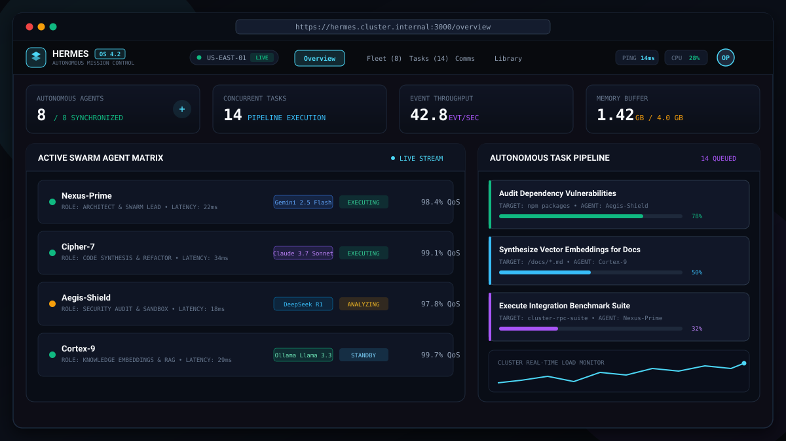
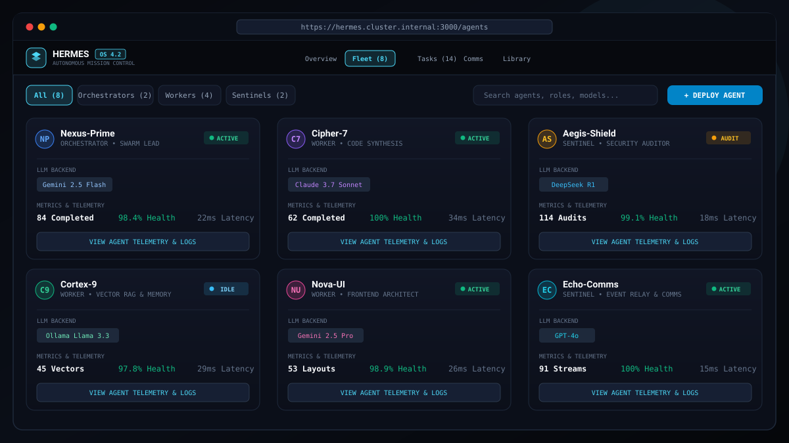
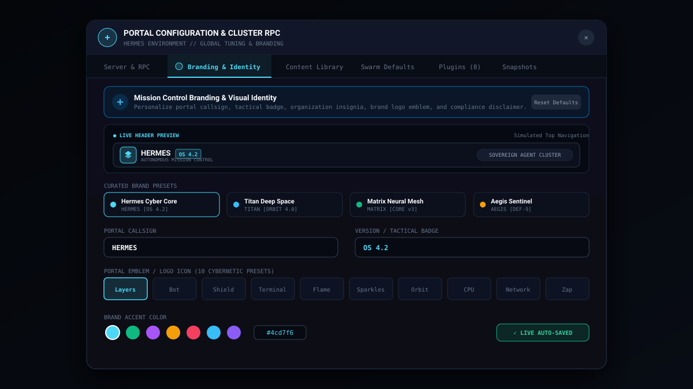

# Hermes • Autonomous Agent Mission Control

<div align="center">

[](https://opensource.org/licenses/Apache-2.0)
[](https://react.dev/)
[](https://www.typescriptlang.org/)
[](https://tailwindcss.com/)
[](https://vitejs.dev/)

**A cybernetic command portal for orchestrating, monitoring, and debugging distributed autonomous AI agent fleets.**

[Features](#-key-features) • [Screenshots](#-visual-walkthrough) • [Real Agent Setup Guide](./HERMES_CONNECTION_GUIDE.md) • [Portal Branding](#-portal-branding--white-labeling) • [Plugin Ecosystem](#-plugin--extension-ecosystem) • [Quickstart](#-quickstart)

</div>

> **Real Agent Mode**: To connect directly to your local or remote Hermes Agent with zero mockup data, follow the **[Hermes Agent Connection Guide](./HERMES_CONNECTION_GUIDE.md)** (default port `8642`).

---

## 📸 Visual Walkthrough

### 1. Mission Control Overview & Telemetry Matrix
Real-time fleet telemetry, ping monitors, resource headroom, active agent states, and concurrent autonomous task pipelines.



---

### 2. Autonomous Agent Fleet & Model Routing
Detailed view of all active agents across roles (Orchestrators, Workers, Sentinels) with multi-model backends (Gemini 2.5 Flash, Claude 3.7 Sonnet, DeepSeek R1, Ollama Llama 3.3).



---

### 3. Portal Branding & Visual Identity Suite
Built-in white-labeling and visual customizer: live header preview, 10 cybernetic logo emblems, custom SVG/PNG logo upload, custom accent hex colors, and organization insignia.



---

## ⚡ Key Features

### 🌌 Autonomous Swarm Fleet Management
- **Hierarchical Agent Roles**: Seamlessly coordinate Lead Orchestrators, Full-Stack Workers, Security Sentinels, and RAG Knowledge Workers.
- **Multi-Model Support**: Direct support and routing for Gemini 2.5 Flash/Pro, Claude 3.7 Sonnet, DeepSeek R1, OpenAI GPT-4o, and local Ollama instances.
- **Real-Time Health & QoS**: Live ping telemetry, token throughput monitors, memory quotas, and execution logs for every individual agent.

### 📋 Live Task Kanban & Streaming Pipelines
- **Dynamic Task Stages**: Track tasks through *Backlog*, *Queued*, *In Progress*, *Review/Verification*, and *Completed*.
- **Agent Assignment & Sub-task Breakdown**: Visual subtask progress bars, agent avatars, execution logs, and priority markers (Low, Medium, High, Critical).
- **Execution Event Stream**: Live telemetry events logging tool calls, code compilation, sandbox executions, and security checks.

### 🎨 Portal Branding & White-Labeling (New!)
- **Custom Callsign & Subtitle**: Configure the primary mission control title (e.g. `HERMES`, `TITAN`, `MATRIX`, `AEGIS`).
- **Tactical Release Badges**: Appended micro tags (e.g. `OS 4.2`, `CORE v3`, `DEF-9`).
- **10 Cybernetic Logo Emblems**: One-click selection from vector emblems (*Layers*, *Bot*, *Shield*, *Terminal*, *Flame*, *Sparkles*, *Orbit*, *CPU*, *Network*, *Zap*).
- **Custom Image / SVG Logo**: Provide an HTTPS URL to custom brand vectors or transparent PNGs.
- **Organization Insignia**: Display sovereign cluster division badges in the top navigation header.
- **Color Accent Theming**: Instant HEX palette customizer with live header and footer synchronization.
- **Curated Presets**: Quick-switch between *Hermes Cyber Core*, *Titan Deep Space*, *Matrix Neural Mesh*, and *Aegis Sentinel*.

### 🧩 Plugin & Extension System
- **Pre-installed Cybernetic Extensions**: Sound FX synthesizers, CRT scanline overlays, neon pulse shaders, and real-time network graphs.
- **User-Defined Extensions**: Create and toggle custom visual, audio, telemetry, or utility plugins on the fly.
- **Custom CSS Engine**: Live CSS editor that immediately injects rules into the mission control canvas with syntax highlighting and instant preview.

### 🛡️ Operator Profile & Avatar Customizer
- **Non-blocking Modal Architecture**: Scroll-safe viewport container with pinned action bars to prevent out-of-boundary clipping.
- **Callsign & Clearance Levels**: Configure operator ID, security clearance (Alpha to Omega), and role designation.
- **Avatar Gallery & Custom Photo URL**: Choose from cybernetic avatars or link personal photo/avatar URLs.

### 🐾 Cyber Pet Companion
- **Autonomous Desktop Assistant**: Interactive floating cybernetic creature providing real-time fleet diagnostics, encouragement, and playful chatter.
- **Species Variants**: Switch between Cyber Kitty, Pixel Drone, Neon Sprite, and Quantum Fox.

### 💾 Backup, Snapshots & Local Persistence
- **Full JSON Cluster Snapshots**: Export complete cluster states (fleets, agents, active tasks, memory volumes, and settings) with one click.
- **Instant Restore & Validation**: Inspect snapshot file contents with schema validation before applying.
- **Zero Data Loss**: In-memory and local persistence keeps all configuration active across reloads.

---

## 🛠️ Architecture & Tech Stack

```
hermes-mission-control/
├── public/
│   └── screenshots/              # High-resolution vector SVG screenshots
├── src/
│   ├── components/               # UI components & Mission Control modals
│   │   ├── Navbar.tsx            # Dynamic header with pulse & brand insignia
│   │   ├── Footer.tsx            # Sticky compliance & telemetry status bar
│   │   ├── OverviewTab.tsx       # Fleet stats, charts & streaming event log
│   │   ├── AgentsTab.tsx         # Agent fleet matrix & deployment cards
│   │   ├── TasksTab.tsx          # Autonomous tasks kanban board
│   │   ├── ChatTab.tsx           # Inter-agent & operator comms channel
│   │   ├── ContentLibraryTab.tsx # Vector embeddings & content volumes
│   │   ├── PortalSettingsModal.tsx # Hub: Server, Branding, Storage, Plugins, Backup
│   │   ├── OperatorProfileModal.tsx # Responsive profile & avatar editor
│   │   ├── CyberPet.tsx          # Interactive ambient companion
│   │   ├── SkinSelectorModal.tsx # Cyberpunk theme skin switchers
│   │   └── CliModal.tsx          # Operator CLI terminal
│   ├── context/
│   │   ├── ClusterContext.tsx    # State management for agents, tasks, & branding
│   │   ├── PluginsContext.tsx    # Plugin registry & Custom CSS injection
│   │   ├── ThemeContext.tsx      # Cyberpunk visual skins & palettes
│   │   └── PetContext.tsx        # Cyber pet companion behaviors
│   ├── types.ts                  # Strong TypeScript models & interfaces
│   ├── App.tsx                   # Main layout container & tab routing
│   └── main.tsx                  # Application bootstrap entry point
```

- **Frontend Core**: React 18 with TypeScript in strict mode.
- **Styling**: Tailwind CSS with custom cybernetic mesh gradients and glassmorphism backdrops.
- **Iconography**: Lucide React.
- **Tooling**: Vite 5 for fast development and production compilation.

---

## 🚀 Quickstart

### Prerequisites
- Node.js `18.0.0` or higher
- npm or yarn or bun

### Installation

1. **Clone the repository**:
   ```bash
   git clone https://github.com/organization/hermes-mission-control.git
   cd hermes-mission-control
   ```

2. **Install dependencies**:
   ```bash
   npm install
   ```

3. **Start the local development server**:
   ```bash
   npm run dev
   ```
   The portal will boot on `http://localhost:3000`.

4. **Build for production**:
   ```bash
   npm run build
   ```

---

## ⌨️ Keyboard Shortcuts

| Shortcut | Action |
| :--- | :--- |
| `Ctrl` + `` ` `` | Toggle Operator CLI Terminal |
| `Alt` + `1` | Switch to Overview Dashboard |
| `Alt` + `2` | Switch to Agent Fleet Tab |
| `Alt` + `3` | Switch to Tasks Kanban Tab |
| `Alt` + `4` | Switch to Comms & Chat Tab |
| `Alt` + `5` | Switch to Content Library Tab |
| `Esc` | Dismiss any open modal or overlay |

---

## 📄 License

This project is licensed under the Apache License, Version 2.0. See [LICENSE](LICENSE) for details.
